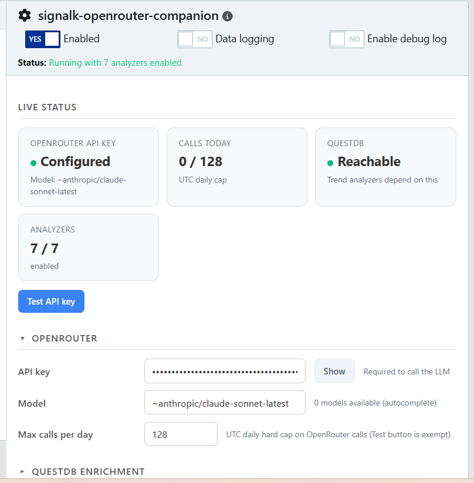
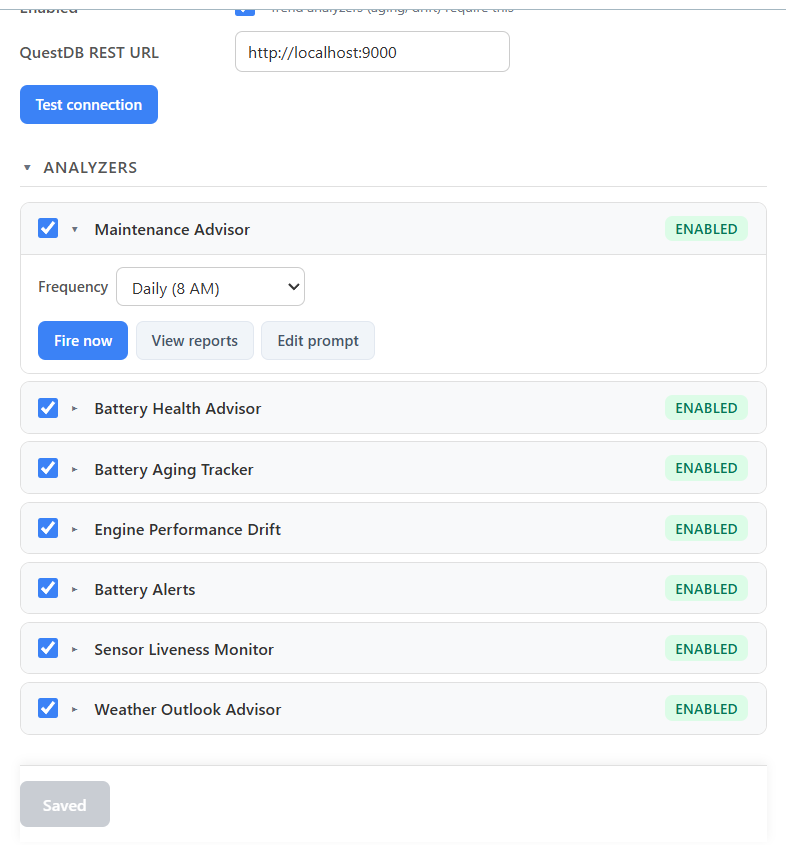

# OpenRouter Companion

[](https://www.npmjs.com/package/signalk-openrouter-companion)
[](https://www.npmjs.com/package/signalk-openrouter-companion)
[](https://github.com/NearlCrews/signalk-openrouter-companion/actions/workflows/ci.yml)
[](https://github.com/NearlCrews/signalk-openrouter-companion/actions/workflows/plugin-ci.yml)
[](LICENSE)
[](https://nodejs.org)
[](https://www.buymeacoffee.com/nearlcrews)

A [Signal K](https://signalk.org) plugin that runs LLM analyzers over your
vessel's propulsion, electrical, and weather telemetry and writes the
results back as plain-prose Signal K notifications. Requires an
[OpenRouter](https://openrouter.ai) API key.

> The battery threshold alerts are written by a cloud LLM call bounded by a
> shared daily budget, so a crossing can go unreported when the budget is
> spent or OpenRouter is unreachable. Do not rely on this plugin as your
> sole battery safety alarm: pair it with a hardware or BMS alarm.

## What's new in 0.6.1

0.6.1 delivers the 0.6.0 OpenRouter cost and reliability work on a corrected
package, with a schema packaging fix so the SignalK App Store lists it cleanly.
All settings are opt-in with no config migration:

- **Daily token and estimated-cost visibility**, accumulated per UTC day from
  OpenRouter's reported cost and shown in the panel status block.
- **Prompt caching** for Anthropic-family models, reusing cached input tokens
  on repeat runs in a burst.
- **Ordered model fallback** via `openrouter.fallbackModels`, so a single
  provider fault falls through to the next model instead of failing the run.
- **Provider routing controls** (`sort`, `maxPrice`, `allowFallbacks`, and
  `zdr`) plus a panel data-collection privacy toggle to route only to providers
  that do not retain request data.
- **Per-report model and cost metadata** recorded in `reports.jsonl` and shown
  in the panel's reports drawer.

See the [v0.6.1 changelog entry](CHANGELOG.md#v061) and the
[full release history](https://github.com/NearlCrews/signalk-openrouter-companion/releases).

## What it does

Signal K is an open marine data standard that streams a boat's navigation,
environment, and electrical data over a single API. OpenRouter Companion
watches that data and, on a schedule, a Signal K PUT, or a vessel event
(an engine stop, a battery threshold crossing), sends the relevant
telemetry to an OpenRouter-hosted model and publishes the model's
plain-prose report as a Signal K notification: how the last engine session
went, how the battery banks are doing, whether capacity is fading over the
season, and where the local weather is heading.

Spend is bounded by a per-day call cap, every run is appended to a JSONL
log on the server, and the whole plugin is configured from a custom panel
in the Signal K admin UI.

## Features

- **Seven independent analyzers**: engine-session maintenance, battery
  health, battery threshold alerts, capacity aging, engine performance
  drift, sensor liveness, and a short-term weather outlook.
- **Plain-prose reports** published as Signal K notifications, readable in
  the Data Browser, each led by a headline short enough for a chartplotter
  alert.
- **Three trigger kinds per analyzer**: a cron schedule, a Signal K PUT,
  or a vessel event.
- **A per-day OpenRouter call cap** (default 20 calls per UTC day) to
  bound spend.
- **A JSONL report log**: every run is appended to `reports.jsonl` in the
  plugin's data directory, with the full report text.
- **A custom React configuration panel** in the admin UI, with the
  standard JSON-schema form as a fallback.
- **Optional QuestDB history** for the trend analyzers, via a co-installed
  [`signalk-questdb`](https://www.npmjs.com/package/signalk-questdb).
- **NMEA 2000 bridging**: battery alerts carry stable alert ids that a
  co-installed
  [`signalk-nmea2000-emitter-cannon`](https://github.com/NearlCrews/signalk-nmea2000-emitter-cannon)
  can forward to a chartplotter.

## Screenshots

| Live status and OpenRouter settings | Analyzer cards |
| --- | --- |
| [](assets/screenshots/panel-overview.png) | [](assets/screenshots/panel-analyzers.png) |

## Architecture

OpenRouter Companion is one plugin built from focused modules:

- **One npm package.** Each monitoring domain is an `Analyzer` module
  under `src/analyzers/`, wired through a shared registry; the trigger
  router, rolling buffer, budget tracker, OpenRouter client, and QuestDB
  client live in `src/core/`.
- **TypeScript 6, ESM.** esbuild bundles the backend to `dist/index.js`;
  webpack with esbuild-loader bundles the React panel to
  `public/remoteEntry.js` as a Module Federation remote the Signal K
  admin UI loads.
- **Tested with Vitest**, linted and formatted with Biome.

See the [development guide](docs/DEVELOPMENT.md) for the full module map
and the analyzer extension point.

## Requirements

- [Signal K server](https://github.com/SignalK/signalk-server) 2.x. The
  plugin develops against `@signalk/server-api` 2.24 or newer.
- Node.js 20.18 or newer.
- An [OpenRouter](https://openrouter.ai) API key, set in the plugin's
  admin panel. Calls are billed per token.
- Optional: a co-installed
  [`signalk-questdb`](https://www.npmjs.com/package/signalk-questdb). The
  `aging` and `drift` analyzers read history from it, the `forecast`
  analyzer uses it as an optional baseline, and the other four work
  without it.

## Installation

Install from the Signal K admin UI under **AppStore, then Available**, or
from npm:

```bash
cd ~/.signalk
npm install signalk-openrouter-companion
```

From source:

```bash
git clone https://github.com/NearlCrews/signalk-openrouter-companion.git
cd signalk-openrouter-companion
npm install
npm run build
ln -s "$(pwd)" ~/.signalk/node_modules/signalk-openrouter-companion
```

Then enable it under **Server, then Plugin Config** and set your
OpenRouter API key in the panel that opens.

## Configuration

The plugin ships a custom admin panel that replaces the default Signal K
plugin form. The main settings:

| Setting | Description | Default |
|---------|-------------|---------|
| OpenRouter API key | Required. Key from openrouter.ai. | n/a |
| Model | OpenRouter model slug. | anthropic/claude-haiku-4.5 |
| Max calls per day | Hard cap on OpenRouter calls per UTC day, to bound spend. | 20 |
| QuestDB | Optional history source for the trend analyzers. | enabled, localhost:9000 |
| Analyzers | Each of the seven can be enabled or disabled independently. | six on by default; the weather outlook is opt-in |

Advanced settings (engine RPM thresholds, cell-imbalance settle times,
trend window lengths, custom cron patterns) are not in the panel; they
live in the saved JSON config at
`~/.signalk/plugin-config-data/signalk-openrouter-companion.json`.

Advanced OpenRouter settings, edited in the saved JSON config under
`openrouter`:

| Key | Meaning | Default |
|-----|---------|---------|
| `fallbackModels` | Ordered list of model slugs to try if the primary is unavailable. | none |
| `provider.sort` | Routing preference: `price`, `throughput`, or `latency`. | unset |
| `provider.maxPrice` | Per-call price ceiling. `prompt` and `completion` are USD per million tokens; `request` is a flat USD per request. | unset |
| `provider.allowFallbacks` | When `false`, a run fails rather than substituting another provider. | unset; OpenRouter default: `true` |
| `provider.dataCollection` | Set to `deny` to route only to providers that do not retain request data. Also available as a panel toggle. | unset; OpenRouter default: `allow` |
| `provider.zdr` | Require zero-data-retention providers. | unset; OpenRouter default: `false` |

Token use and estimated cost per day are shown in the panel status block, and
per-report model and cost are recorded in `reports.jsonl`. The cost figure is
OpenRouter's reported `usage.cost`. If you use a Bring-Your-Own-Key provider,
that figure reflects only OpenRouter's fee, not the upstream provider charge,
so it understates true spend.

A tight provider configuration (a low `maxPrice`, `dataCollection: deny`,
`zdr: true`, or `allowFallbacks: false`) can leave no eligible provider; the
run then fails fast with OpenRouter's routing message rather than retrying.

## Analyzers

Seven analyzers ship; six are enabled by default. The weather outlook is
opt-in because it benefits from a barometer or anemometer on the vessel
and is more chatty than the per-event analyzers. The two QuestDB-backed
trend analyzers need a few weeks of history before their reports are
meaningful.

- **maintenance**: a short narrative of each completed engine session.
  Fires when the engine stops.
- **health**: a daily snapshot of every battery bank.
- **alerts**: real-time battery threshold crossings (low state of charge,
  cell imbalance), as alarm-grade notifications.
- **aging**: a monthly look at battery capacity loss per bank over two
  configurable windows (default 30 and 90 days). Reads QuestDB history.
- **drift**: a weekly look at engine fuel economy and per-RPM drift
  against a configurable trailing baseline (default 30 days). Reads
  QuestDB history.
- **liveness**: a daily check that the data the other analyzers depend on
  is still flowing, flagging stale and multi-source paths.
- **forecast**: a short-term weather outlook. Reads how barometric
  pressure, wind, temperature, and (when available) cloud, visibility,
  and precipitation are trending, then predicts how conditions develop
  over the next few hours. Works with a real onboard barometer and
  anemometer, or with
  [`signalk-virtual-weather-sensors`](https://www.npmjs.com/package/signalk-virtual-weather-sensors).
  A severity-floor dropdown sets when the outlook raises an alarm. Runs
  every 3 hours by default.

Reports publish as informational notifications (`state: nominal`). The
`alerts` analyzer publishes true alerts with a stable alert id, which a
co-installed
[`signalk-nmea2000-emitter-cannon`](https://github.com/NearlCrews/signalk-nmea2000-emitter-cannon)
can forward to a NMEA 2000 chartplotter. The `forecast` analyzer publishes
its outlook at `state: nominal` and escalates to an alert state when the
predicted severity meets the configured floor.

> [!IMPORTANT]
> The `alerts` analyzer writes its alert text with an OpenRouter call, so
> a battery crossing is reported only when that call succeeds and the
> shared daily budget (Max calls per day) is not yet exhausted. If the
> budget is spent, or OpenRouter is unreachable, a crossing may not raise
> a notification at the helm. The underlying detection still runs, but the
> operator-facing alarm depends on a cloud call. Do not rely on this as
> your sole battery safety alarm: pair it with a hardware or BMS alarm,
> and set the daily budget high enough to cover your expected crossings.

## Documentation

- [Development guide](docs/DEVELOPMENT.md): architecture, the analyzer
  extension point, the REST API, build, and tests
- [Changelog](CHANGELOG.md)
- [Contributing](.github/CONTRIBUTING.md)
- [Security policy](.github/SECURITY.md)

## Development

This project targets Node 20.18 or newer, with TypeScript 6 (development
only). CI runs the suite on Node 20 and 22.

```bash
git clone https://github.com/NearlCrews/signalk-openrouter-companion.git
cd signalk-openrouter-companion
npm install          # install dependencies
npm run build        # bundle the backend and the panel
npm test             # Vitest suite
npm run type-check   # type-check without emitting
npm run lint         # Biome lint
npm run lint:fix     # lint and auto-fix
npm run validate     # type-check, lint, and tests in one go
npm run clean        # remove dist/ and public/
```

Run `npm run validate` and `npm run build` before pushing. See the
[development guide](docs/DEVELOPMENT.md) for the full workflow.

## License

Apache-2.0: see [LICENSE](LICENSE) for the full text. The software is
provided "AS IS", without warranty of any kind. Treat the generated
reports and alerts as advisory, and keep independent engine and battery
monitoring in place.

## Acknowledgments

Written and maintained by [Nearl Crews](https://github.com/NearlCrews).

- [Signal K Project](https://signalk.org/) for the open marine data
  standard
- [OpenRouter](https://openrouter.ai) for the unified LLM API
- [QuestDB](https://questdb.io) for the time-series database the trend
  analyzers read

OpenRouter Companion pairs well with sibling plugins such as
[`signalk-virtual-weather-sensors`](https://www.npmjs.com/package/signalk-virtual-weather-sensors)
and [`signalk-nmea2000-emitter-cannon`](https://github.com/NearlCrews/signalk-nmea2000-emitter-cannon).

## Support

Find this plugin useful? You can support its continued development by
[buying me a coffee](https://www.buymeacoffee.com/nearlcrews).

- [Report a bug](https://github.com/NearlCrews/signalk-openrouter-companion/issues/new?template=bug_report.yml)
- [Request a feature](https://github.com/NearlCrews/signalk-openrouter-companion/issues/new?template=feature_request.yml)
- [Security issues](.github/SECURITY.md)
